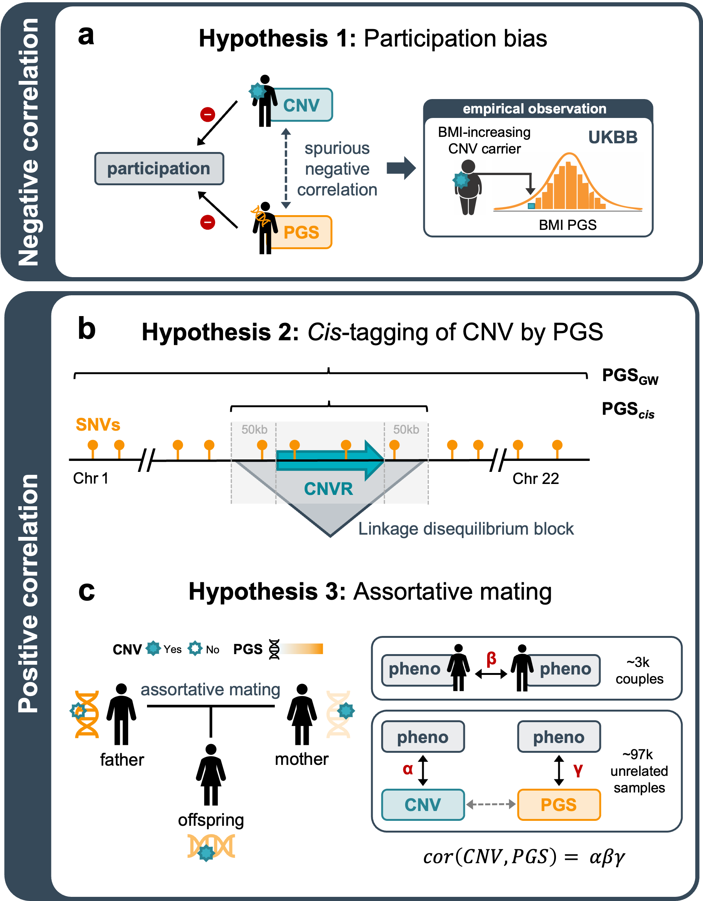

# Contribution of PGS to variable expressivity of CNVs
Code repository for *"The impact of rare pathogenic CNVs is exacerbated by assortative mating"*

**DOI:** [ADD DOI]

**Contact:** Chiara Auwerx (cauwerx -at- mgh.harvard.edu); Caterina Cevallos (caterina.cevallos -at- unil.ch); Zoltan Kutalik (zoltan.kutalik -at- unil.ch).

**Summary:** 
Copy-number variants (CNVs) are linked to a spectrum of outcomes, ranging from subtle to severe among carriers of the same variant. We explored the impact of an individual's polygenic score (PGS) on explaining these differences, focusing on 119 established CNV-trait associations involving 43 clinically-relevant phenotypes. We called CNVs among white British UK Biobank participants, then divided samples into a training set (n = 264,372) to derive independent PGS weights, and a CNV-carrier-enriched test set (n = 96,716) for which PGSs were computed. Assessing the individual, joint, and synergistic contribution of CNVs and PGS identified a significant additive effect for 45 (38%) CNV-trait pairs but no evidence for interactions. A (spurious) negative correlation between an individual’s CNV carrier status and their PGS would be expected under selective participation-induced collider bias. Instead, we observed a widespread positive correlation, which could only be partially accounted for by linkage disequilibrium. Given a non-null inheritance rate for 86% of the testable CNVs, we explored whether assortative mating could explain the positive CNV-PGS association and found that 45% (p = 3.9e-7) of this correlation could be predicted by the latter. Similar trends of positive correlation were observed between PGS and genome-wide burden of CNVs or rare loss-of-function variants. Our results suggest that PGSs contribute to the variable expressivity of CNVs and rare variants, and improve the identification of those at higher risk of clinically relevant comorbidities. We highlight pervasive assortative mating as a likely mechanism contributing to the compounding of genetic effects across mutational classes. 

## Study overview:

 **Figure 1: Mechanisms of CNV-PGS correlation.** (**A**) Schematic representation of three possible mechanisms explaining correlation between an individual's CNV carrier status and polygenic score (PGS). (**a**) Negative CNV-PGS correlation is expected in the presence of selective UK Biobank (UKBB) participation. Specifically, if both CNV carrier status and PGS predict participation in the same direction (e.g., decreasing or increasing participation probability), collider bias would result in a spurious negative CNV-PGS correlation among UKBB participants. As UKBB participants tend to be healthier than the general population, we expect both carriers of deleterious CNVs and individuals with a PGS that phenocopies the impact of the CNV to be less likely to participate. This leads to the observation of a lower PGS among carriers of a trait-increasing CNV compared to non-carriers, as illustrated here with a body mass index (BMI)-increasing CNV. (**b**) A first mechanism explaining positive CNV-PGS correlation is tagging of the CNV by the PGS due to the CNV being in linkage disequilibrium with single nucleotide variants (SNVs) included in the genome-wide PGS (PGSGW). This hypothesis can be explored by subseting PGSGW into a PGS_cis_ that is restricted to single nucleotide variants (SNVs) mapping to the CNV region (CNVR) ± 50 kb. (**c**) An alternative mechanism for positive CNV-PGS correlation is assortative mating, where two individuals exhibiting similar phenotypes due to different underlying genetic etiologies, e.g., a high PGS in the father and a trait-increasing CNV in the mother, produce offspring that carry both genetic risk factors. This hypothesis can be explored by assessing the fraction of empirically observed CNV-PGS correlation that can be explained by an indirect path mediated by assortative mating, derived from multiplying the CNV-trait correlation (alpha), the within-couple phenotypic correlation (beta), and the PGS-trait correlation (gamma).

## Description of content:

Each folder contains the script to execute the following analyses:

- **01_construct_PGS:** Contains the pipeline to split samples into a training and testing set (`01_sample_split`). The training set is used to run genome-wide association studies (`02_GWAS`), whose summary statistics were used to develop polygenic scores (`03_PGS_development`). Finally, PGS weights were applied to the testing set and PGS performance was assessed (`04_PGS_application`).

- **02_model_phenotype:** The impact 
  
- **03_model_PGS:**

- **04_model_assortative_mating:**

- **05_inheritance_rate:**

## Data availability: 

Data are made available as supplementary tables of the manuscript.
